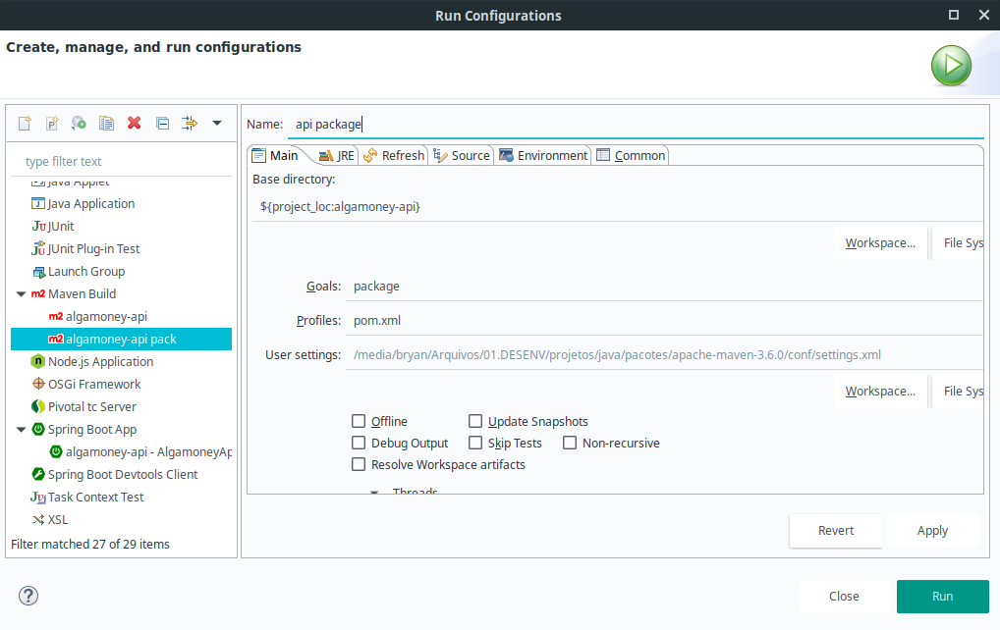

# Curso de REST com Spring Boot

Curso de RESTfull com Spring Boot.

## Projeto AlgaMoney-API

…or create a new repository on the command line

```bash
echo "# algamoney-api" >> README.md
git init
git add README.md
git commit -m "first commit"
git remote add origin git@github.com:carlosanders/algamoney-api.git
git push -u origin master
```

…or push an existing repository from the command line

```bash
git remote add origin git@github.com:carlosanders/algamoney-api.git
git push -u origin master
```

### Gerando o jar executável do projeto

Para gerar o **jar** executavel, basta adicionar na tag build do `pom.xml` o seguinte:

```xml
...
<build>
		<plugins>
			<plugin>
				<groupId>org.springframework.boot</groupId>
				<artifactId>spring-boot-maven-plugin</artifactId>
			</plugin>
			<!-- DEFINE O PLUGIN MAVEN RESPONSÁVEL POR COMPILAR O PROJETO SUA VERSÃO 
				E O JDK UTILIZADO -->
			<plugin>
				<groupId>org.apache.maven.plugins</groupId>
				<artifactId>maven-compiler-plugin</artifactId>
				<configuration>
					<archive>
						<!-- DEFINE QUAL É A CLASSE MAIN DA APLICAÇÃO -->
						<manifest>
							<addClasspath>true</addClasspath>
							<mainClass>com.algaworks.algamoney.api.AlgamoneyApiApplication</mainClass>
						</manifest>
					</archive>
				</configuration>
			</plugin>

		</plugins>
	</build>
```

**Fonte:**

*  [https://medium.com/@andgomes/maven-gerando-jars-execut%C3%A1veis-com-projetos-com-depend%C3%AAncias-5bcd022058ee](https://medium.com/@andgomes/maven-gerando-jars-execut%C3%A1veis-com-projetos-com-depend%C3%AAncias-5bcd022058ee)

* [http://www.semeru.com.br/blog/gerando-um-jar-com-as-dependencias-em-um-projeto-maven/](http://www.semeru.com.br/blog/gerando-um-jar-com-as-dependencias-em-um-projeto-maven/)

  

Executar o projeto pelo **bash**, desde que se tenha instalado no PATH o maven corretamente:

```bash
bryan@inspiron-3421:/codigo-fonte/workspace-sts-3.9.7/algamoney-api
$ mvn clean 
bryan@inspiron-3421:/codigo-fonte/workspace-sts-3.9.7/algamoney-api
$ mvn package 

# para rodar o jar basta:
$ java -jar algamoney-api-1.0.0.jar
# ou caso queira alterar algum parametro do resource
# ex.: alterar usuario/senha banco
$ java -jar algamoney-api-1.0.0.jar --spring.datasource.username=root --spring.datasource.password=root
```

Executar pela IDE Eclipse/STS:



### Gerando o war a partir do jar


